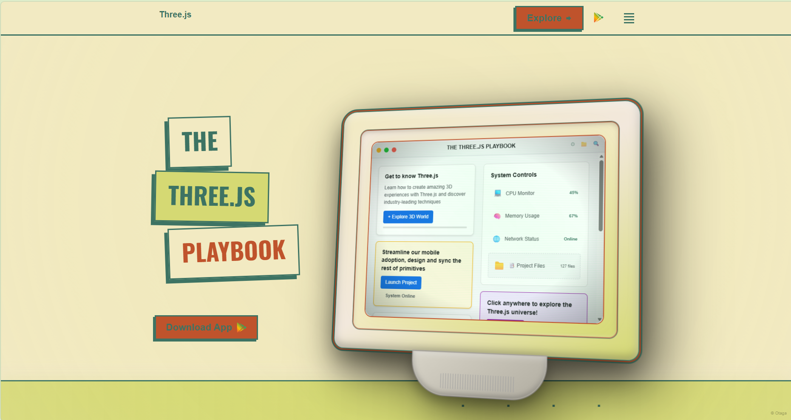

# Three.js Sample Geeks - The Three.js Playbook

Welcome to **The Three.js Playbook**, a premium interactive platform designed for Three.js enthusiasts and developers. This project provides a unique, retro-styled environment to explore, learn, and experiment with 3D web graphics.



## 🚀 Overview

The Three.js Playbook is more than just a documentation site; it's an interactive experience. Featuring a custom-built Retro IDE, GSAP-powered transitions, and a curated set of Three.js examples, it offers a hands-on approach to mastering 3D on the web.

## ✨ Key Features

- **Retro HTML IDE**: A fully functional code editor with a vintage aesthetic, allowing you to write and preview Three.js code in real-time.
- **Interactive Playground**: Experiment with various Three.js concepts directly in the browser.
- **Modern Animations**: Smooth, high-performance animations powered by GSAP (GreenSock Animation Platform).
- **Curated Examples**: Access a collection of professionally crafted Three.js demos and templates.
- **Responsive Design**: A premium, "earthy" theme that works seamlessly across all device sizes.
- **Firebase Integration**: Built for easy deployment and hosting via Firebase.

## 🛠️ Tech Stack

- **Core**: HTML5, CSS3, JavaScript
- **3D Engine**: [Three.js](https://threejs.org/)
- **Animations**: [GSAP](https://greensock.com/gsap/)
- **Code Editor**: [CodeMirror](https://codemirror.net/)
- **Hosting**: [Firebase](https://firebase.google.com/)
- **Typography**: Google Fonts (Oswald, Orbitron, Space Mono, Poppins, VT323)

## 📂 Project Structure

```text
SAMPLEGEEKSWEBSITE/
├── public/              # Production-ready assets
│   ├── img/            # Images and textures
│   ├── models/         # 3D models (GLTF/OBJ)
│   ├── index.html      # Main entry point
│   ├── home.css        # Core design system
│   └── home.js         # Main application logic
├── firebase.json       # Firebase configuration
└── README.md           # Project documentation
```

## 🚦 Getting Started

To run this project locally:

1.  **Clone the repository**:
    ```bash
    git clone https://github.com/your-repo/three.js-sample-geeks.git
    ```
2.  **Navigate to the project directory**:
    ```bash
    cd SAMPLEGEEKSWEBSITE
    ```
3.  **Serve the files**:
    You can use any local web server. For example, using Python:
    ```bash
    python -m http.server 8000
    ```
    Or using `serve`:
    ```bash
    npx serve public
    ```
4.  **Open in Browser**:
    Visit `http://localhost:8000` (or the port specified by your server).

## 📄 License

This project is licensed under the MIT License - see the LICENSE file for details.

---

Built with ❤️ by [Sample Geeks](https://samplegeeks.com)
